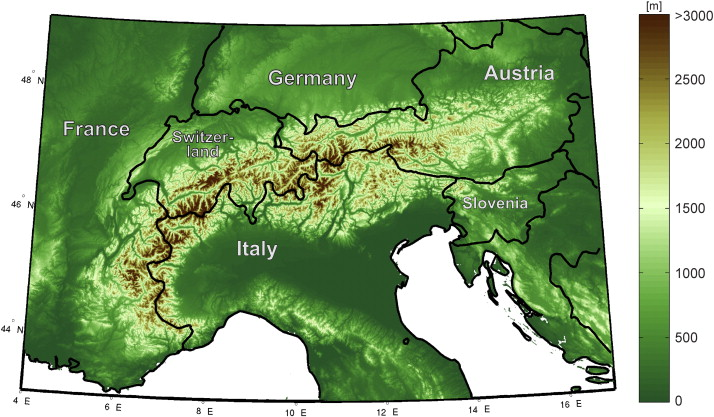

# INTRODUZIONE
Il monitoraggio continuo della vegetazione è cruciale per consentire una capacità decisionale informata nelle politiche di conservazione, per un'efficace gestione della bioidversità (Basit et al., 2024).

Per gestire in modo efficace gli ecosistemi, in particolare quelli montani, è quindi importante stimare la variabilità spazio-temporale della vegetazione e le variabili climatiche associate e responsabili di tali cambiamenti (Basit et al., 2024). I parametri climatici che più influenzano la distribuzione spaziale della vegetazione sono la temperatura e le precipitazioni: infatti, un aumento delle temperature potrebbe da un lato aumentare l'attività fotosintetica della vegetazione, ma dall'altro il riscaldamento oltre certi livelli provocherebbe problemi da un punto di vista di biliancio idro-termico e, di conseguenza, avrebbe effetti sulla crescita della pianta; le precipitazioni, invece, sono fondamentali per la disponibilità di acqua nel suolo e quindi prolungati periodi di siccità possono portare alla morte degli organismi vegetali (Basit et al., 2024).
Questa tipologia di analisi permette di fare inferenze anche sul cambiamento delle tipologie di vegetazione in relazione alle condizioni di precipitazione e temperatura, alla posizione geografica e le loro variazioni nel tempo.

In questo contesto, il telerilevamento satellitare è uno strumento molto importante, che permette di monitorare la superficie terrestre, e quindi anche la copertura vegetativa, a scala globale, regionale e locale. I dati vengono acquisiti in maniera continua e dettagliata attraverso satelliti e sensori e si possono ottenere serie temporali che forniscono dati fondamentali per analizzare i driver della distribuzione delle specie e le relative dinamiche tempolari. Per questo motivo, l'integrazione tra dati di remote sensing e il monitoraggio ambientale permette di abbattere i costi e di ottenere informazioni anche a più ampia scala temporale e spaziale (Alírio et al., 2025). 

Nello specifico, Google Earth Engine (GEE; https://earthengine.google.com/) è una piattaforma cloud-based sviluppata da Google per analisi dei dati ambientali a scala planetaria: attarverso GEE scienziati, ricercatori e sviluppatori possono analizzare una vasta gamma di dati geospaziali, tramite l'accesso a varie immagini satellitari e ad altri dataset geospaziali, come il clima, la copertura e l'uso del suolo e dati terrestri (Alírio et al., 2025).

## L'arco alpino
Le Alpi sono un'arco montuoso di 800 km con un'ampiezza media di circa 200 km e un'altezza media di 2.5 km e si estendono prima in direzione nord–sud dal Mediterraneo in Francia, poi curvano verso est attraverso la Svizzera e infine si estendono in direzione est–ovest fino all'Austria orientale (Beniston, 2006; Schar et al., 1998).
La localizzazione geografica e la configurazione delle Alpi le rende una regione particolarmente interessante per molti studi climatici e ambientali, perchè sono caratterizzate da influenze oceaniche, continentali, polari e, occasionalmente, sahariane (Beniston, 2006).

### Topografia dell'arco alpino

### Clima nell'arco alpino
Le Alpi sono in una certa misura delimitate dalle influenze concorrenti del Mediterraneo, dell'Atlantico e, in misura minore, del Mare del Nord e del Baltico, e si trovano in una delle zone più calde delle medie latitudini dell'emisfero settentrionale a causa della vicinanza dell’influenza modulante dell’Oceano Atlantico e del serbatoio di calore rappresentato dal Mar Mediterraneo. L'arco alpino è quindi soggetto all'influenza delle tempeste che attraversano l'Atlantico o si sviluppano nel Mediterraneo, ma può anche influenzare i modelli meteorologici in diversi modi, ad esempio attraverso lo sviluppo di sistemi di bassa pressione derivanti dall'interazione tra flussi atmosferici su larga scala e topografia e nell'innesco di onde turbolente di montagna, cioè onde gravitazionali la cui influenza può essere avvertita molto a valle delle montagne stesse (Beniston, 2006).
La topografia alpina influenza la circolazione atmosferica deviando il flusso orizzontalmente e verticalmente, attraverso l'introduzione di elevate fonti e pozzi di calore sensibile e latente e attraverso l'induzione di onde che si propagano nell'atmosfera libera (Schar et al., 1998).

Per quanto riguarda la temperatura, esiste una variazione spaziale con un gradiente nord-sud che è dovuta principalmente alle caratteristiche topografiche. Inoltre, sono osseravti anche gradienti est-ovest di temperatura, in particolare confrontando l'arco alpino con la pianura adiacente, per una scala temporale sia diurna che stagionale (Schar et al., 1998).

Le precipitazioni nelle regioni montane di solito differiscono considerevolmente da quelle delle pianure circostanti (Schar et al., 1998).
I segnali delle precipitazioni alpine rivelano una grande variabilità spaziale dalla scala delle Alpi nella loro totalità a quella dei singoli versanti e questo riguarda sia la media nel lungo termine che la comparsa di forti precipitazioni (Schar et al., 1998).
In generale, le precipitazioni totali annuali e stagionali aumentano con l'altitudine, ma questa relazione mostra forti variazioni per quanto riguarda le località e le stagioni (Schar et al., 1998).
Le precipitazioni nella regione alpina sono un parametro climatico particolarmente importante e non solo per la sua rilevanza per sistemi ecologici ed economici: siccome le precipitazioni risultano da una catena di processi complessi e non lineari, è molto sensibile a parametri esterni; quindi, il riscaldamento globale porebbe influenzare sostanzialmente la frequenza e la distribuzione delle precipitazioni (Schar et al., 1998).
Nella zona umida settentrionale, le medie annuali eccedono i 2000 mm per anno in varie località; nella zona umida meridionale nella regione del Friuli, i valori di precipitazione raggiungono i 3000 mm per anno in alcuni punti, mentre un valore intorno ai 2500 mm per anni è osservato nella valle delle Centovalli in Ticino (Schar et al., 1998).

> Ulteriori dati su precipitazioni e temperatura?

# MATERIALI
## Area di studio

L'area di studio comprende sette valli che sono state scelte come area campione.

Le valli corrispondono a tre valli in Piemonte (Valle Stura, Val di Susa e Val Grande), una valle in Lombardia (Valle Camonica), una valle in Trentino-Alto Adige (Val di Non), una valle in Veneto (Val di Zoldo) e una valle in Friuli-Venezia-Giulia (Alta valle del Tagliamento). La scelta di queste valli è stata dettata dalla volontà di studiare aree distribuite in tutto l'arco alpino e con due orientamenti principali: sono infatti state selezionate tre valli disposte con orientamento nord-sud (Val Grande, Valle Camonica e Val di Non) e quattro valli disposte con orientamento est-ovest (Valle Stura, Val di Susa, Val di Zoldo e Alta valle del Tagliamento). In questo modo, è stato possibile confrontare i dati di precipitazione e temperatura sia in funzione dei settori alpini, che in funzione dell'orientamento delle valli.

## Dataset
### Dati climatici

I dati climatici sono stati presi da TerraClimate, un dataset mensile ad alta risoluzione spaziale (1/24°,~4-km) relativo alle condizioni climatiche globali, che copre il periodo dal 1958 fino ad oggi, disponibile su Google Earth Engine.

TerraClimate usa un'interpolazione assistita climaticamente, combinando le normali climatologiche ad alta risoluzione del dataset WorldClim con dati mesili delle variabili di climatiche, provenienti da fonti diverse rispetto al dataset WorldClim, restituendole con una risoluzione molto più grossolana. TerraClimate riesce quindi a produrre dei dati mensili di precipitazioni, temperature massime e minime, velocità del vento, pressione di vapore e radiazione solare.

TerraClimate è ad accesso pubblico posizionato in una repository dell'università di Idaho’s Northwest Knowledge Network; i dati sono aggiornati periodicamente una volta che il dato dell'anno è diventato disponibile (Abatzoglou et al., 2018).

### Dati sulla distribuzione delle tipologie di vegetazione
I dati di base della distribuzione delle tipologie di vegetazione nelle valli area di studio provengono, invece, dalla Carta Forestale Italiana.
+ La Carta Forestale Italiana nasce per creare una mappatura e una classificazione delle superfici forestali a livello nazionale, per disporre di informazioni affidabili sugli ecosistemi forestali. Queste informazioni servono per adeguarsi a degli standard internazionali, in modo da raggiungere gli obiettvi stategici europei e di sostenibilità economica e sociale. Si tratta di una carta multidefinizione basata sulla geometria dell’ultimo volo AGEA disponibile, a scala 1:10.000. La Carta Forestale Italiana è sta creata su due criteri: la definizione di bosco da adottare e il sistema di nomenclatura, partendo da definizioni già esistenti. 
  
### Dati territoriali
I dati territoriali provangono dalla digitalizzazione delle valli con il software QGIS utilizzando layer presenti sui geoportali delle regioni italiane interessate (Piemonte, Lombardia, Trentino Alto-Adige, Veneto, Friuli-Venezia-Giulia).

# METODI
### Medoid
An assessment approach for pixel-based image composites (Francini et al.,2023)
+ Il telerilevamento è tra le maggiori fonti del monitoraggio delle dinamiche forestali e molto spesso le immagini che restituiscono i dati telerilevati presentano pixel di nuvole o nebbia poco utili per guardare la copertura del suolo. Ci sono però metodi per evitare questi pixel prodotti tramite dei composites come il Medoid. Il Medoid è un esempio di metodologia del pixel-based compositing, dove il suo scopo principale è quello di creare delle immagini senza nuvole o nebbia.

### Random Forest
Random Forest Algorithm Overview (Salman et al., 2024)
+   Random Forest è un tecnica di machine learning usato nel campo del data mining, sia per la classificazione che per la creazione di modelli predittivi. Questa tecnica si basa sulla creazione di molteplici alberi decisionali (decision tree), generati a partire da sottoinsiemi casuali del dataset originale. Ogni albero viene quindi allenato su una porzione dei dati e le sue predizioni vengono successivamente aggregate per ottenere il modello finale. Ogni albero decisonale è generato in maniera del tutto casuale, sia per quanto riguarda la selezione dei dati sia nella scelta delle variabili usate per le suddivisioni.

Ramndom Forest elabora anche dataset particolaremnte grandi e con molte variabili e funziona anche con dati sbilanciati e alla presenza di valori mancanti.

# BIBLIOGRAFIA
+ https://www.regione.piemonte.it/giscartografia/Parchi/schede_settori_ecogeografici.pdf
+ https://www.arpa.fvg.it/temi/temi/meteo-e-clima/ultimi-approfondimenti-pubblicati/clima-e-cambiamenti-climatici-nelle-aree-montane-del-friuli-venezia-giulia/
+ Geoportale Regione Piemonte: https://geoportale.igr.piemonte.it/cms/
+ Geoportale Regione Lombardia: https://www.geoportale.regione.lombardia.it/
+ Portale Geoocartografico del Trentino: http://www.territorio.provincia.tn.it/portal/server.pt/community/portale_geocartografico_trentino/254
+ Geoportale Regione Veneto: https://idt2.regione.veneto.it/
+ Geoportale Friuli-Venezia-Giulia: https://www.regione.fvg.it/rafvg/cms/RAFVG/ambiente-territorio/conoscere-ambiente-territorio/FOGLIA4/
+ Mountain weather and climate: A general overview and a focus on climatic change in the Alps
https://link.springer.com/article/10.1007/s10750-005-1802-0
+ Current Alpine Climate (Schar et al., 1998)
https://iacweb.ethz.ch/doc/publications/1998_Schar_AlpineClimate.pdf

--------------------------------

# CARATTERISTICHE DELLE VALLI
## VALLE STURA
+ Clima: la Valle Stura di Demonte è orientata da est ad ovest come le valli principali delle Alpi sudoccidentali, a differenza delle Alpi Marittime s.s e Liguri dove, sul versante piemontese,
l'orientamento prevalente è da nord a sud. Ciò condiziona l'afflusso di aria umida marina per cui relativamente asciutta è la Valle Stura, mentre valori più elevati, con precipitazioni tra 900 e 1200 mm,
caratterizzano le altre valli dove il massimo autunnale supera quello primaverile ed il minimo assoluto è quello estivo e non invernale determinando in tal modo più elevate precipitazioni nevose.
Il margine settentrionale delle Alpi Marittime s. s. e Liguri è abbastanza ben delineato delle isoterme 10 °C ed 11 °C e dalla isoieta dei 1000 mm.

+ Vegetazione e Suoli: questi ultimi sono Settori caratterizzati da una straordinaria ricchezza floristica per numero e varietà di specie,
ospitano gli endemismi più significativi delle Alpi ed un numero elevato di relitti tassonomici, di fitocenosi e di popolamenti esclusivi, in particolare nelle stazioni rupestri.

## VAL DI SUSA
+ Clima: settori ben definiti climaticamente rispetto a quelli circostanti per i bassi valori delle precipitazioni annue ed estive, le prime inferiori a 1000 mm; quelli estremi si registrano in alta Valle di Susa e scendono fino a 600 mm.
L'apertura ad ovest, verso le Alpi francesi, condiziona una elevata continentalità e xericità del clima per la presenza di venti dominanti occidentali che, avendo un andamento prevalentemente parallelo all'asta principale della Valle,
determinano scarse precipitazioni e frequenti fenomeni di föhn. Escursioni termiche piuttosto elevate sono tipiche dell'alta Valle di Susa, mentre nel settore inferiore esse sono più moderate.
Ciò, accanto alla mitezza delle temperature medie dei mesi più freddi, spiega la presenza di numerose specie mediterranee (leccio, Juniperus oxycedrus) in oasi xerotermiche della media e bassa Valle di Susa. 

+ Vegetazione e Suolo: l'impronta steppica della vegetazione è generalizzata in tutti i settori ed evidenziata da numerose specie caratteristiche.
L'alta Valle di Susa e Chisone sono comunque caratterizzate da caratteri steppici e più decisamente continentali rispetto alla bassa Valle di Susa.
Le Serie di vegetazione forestale più diffuse e significative sono quelle del larice-pino cembro e dell'abete-picea, ma sui versanti esposti a sud il pino silvestre forma boschi stabili preclimatici.
In bassa e media Valle di Susa la connotazione è decisamente submediterranea.

## VAL GRANDE
+ Clima: precipitazioni medie annue tra 1200 e 2500 mm (Val Cannobina). I valori decrescono da est ad ovest. Le medie del trimestre estivo sono sempre elevate e superiori a 300 mm. Regime pluviometrico di tipo sublitoraneo alpino.

+ Vegetazione e suoli : la vegetazione forestale è caratterizzata, lungo l'asse vallivo principale, da cedui di castagno e boschi misti di latifoglie a struttura irregolare.
Notevole sviluppo hanno le peccete e le abetine variamente consociate con il faggio ed i lariceti. II climax dell'abete assume particolare importanza ed estensione rispettoagli altri territori regionali.

## VALLE CAMONICA

## VAL DI NON

## VALLE DELL'ALTO TAGLIAMENTO
+ Clima:
   + Precipitazioni: Per quanto riguarda la distribuzione delle piogge nell’arco dell’anno, in montagna come in tutta la regione, il mese mediamente meno piovoso è febbraio,
     con valori intorno ai 120-140 mm nella zona prealpina e molto inferiori nelle zone più interne (50-80 mm).
     Durante la primavera le piogge man mano aumentano fino a raggiungere tra maggio e giugno un primo picco intorno ai 250-300 mm mensili sulle Prealpi.
     A luglio le piogge diminuiscono per poi risalire nuovamente a partire dalla terza decade di agosto. La stagione autunnale è decisamente la più piovosa.

  + Temperature: La temperatura media annua registra i valori piuttosto diversificati nel territorio montuoso della regione, dove la temperatura è profondamente influenzata non solo dall’altitudine,
    ma soprattutto dall’esposizione e dall’orientamento delle catene montane delle Prealpi e Alpi Carniche e Giulie, dall’appartenenza ai sistemi idrografici e ai bacini fluviali, dalla conformazione delle valli.
    Considerando le temperature medie mensili, l’andamento annuale registra in generale i valori massimi nei mesi di luglio e agosto e i valori minimi tra gennaio e febbraio.

+ Vegetazione e suolo: 

## VALLE DI ZOLDO

# DA FARE
+ Interfaccia utente
+ Modello per le categorie forestali

# DA CHIEDERE AL PROF.
+ Dobbiamo fare/ha senso calcolare l'NDVI? Lo possiamo fare con i dati della Carta Forestale?

# GRAFICI
+ Correlazione tra temperatura/precipitazione e copertura vegetativa totale (?)

# ARTICOLI INTERESSANTI
+ From Remote Sensing to Species Distribution Modelling (De Simone et al., 2021)
https://www.mdpi.com/2072-4292/13/10/1904
 Il telerilevamento è stato ampiamente usato come strumento per investigare diversi fattori biotici e abiotici, direttamente o indirettamente collegati alla conservazione della biodiversità. È confermato essere uno strumento efficente per studiare i pattern e le dinamiche di vegetazione sia localmente che globalmente: i dati multispettrali come Landsat e Sentinel-2 sono adatti per investigare le dinamiche di vegetazione.

+ [[PDF] Evaluating vegetation dynamics in the Yangtze river basin in relation to climatological parameters using remote sensing data from 2001 to 2022](https://bibliotekanauki.pl/articles/63521188.pdf)

+ Assessment of vegetation dynamics under changed climate situation using geostatistical modeling (Basit et al., 2024)
https://www.proquest.com/docview/2957801522?accountid=9652&sourcetype=Scholarly%20Journals
Lo studio vuole quantificiare gli effetti del cambiamento di diversi parametri climatici sulla salute della vegetazione in Khyber Pakhtunkhwa, Pakistan, dal 2012 al 2021.
  L'associazione tra l'NDVI e le tre variabili esplicative, cioè temperatura, precipitazione e velocità del vento, sono state analizzate usando modelli geostatistici.
  Il fattore climatico più dominante nell'influenza delle dinamiche di vegetazione in KPK è la temperatura, seguito dalla velocità del vento e dalle precipitazioni.
  Nel complesso, l'utilizzo di modelli geostatistici basati su dataset di osservazioni terrestri hanno permesso una profonda comprensione delle variazioni spazio-temporali nelle risposte della vegetazione ai cambiamenti climatici, necessarie per uno sviluppo sostenibile e un'azione climatica responsabile.
  I dati ottenuti dal telerilevamento satellitare sono utili per monitorare e valutare i cambiamenti nella copertura vegetale regionale e globale lungo l'eterogeneità spaziale. Uno degli indici biofisici di vegetazione derivati dai satelliti più utilizzato è il Normalized Difference Vegetation Index (NDVI), che misura la greenness della copertura della vegetazione usando gli spettri di riflettanza alle lunghezze d'onda del rosso e dell'infrarosso vicino.
  > Nell'articolo ci sono altre info sull'NDVI (sottolineate in giallo)

+ TerraClimate, a high-resolution global dataset of monthly climate andc limatic water balance from 1958–2015 (Abatzoglou et al., 2018)
https://www.nature.com/articles/sdata2017191

+ RandomForest: https://journals.mesopotamian.press/index.php/BJML/article/view/417/289

+ Carta Forestale Italiana: https://foresta.sisef.org/contents/?id=efor4836-022

+ Montrends (Alírio et al., 2025)
https://www.sciencedirect.com/science/article/pii/S1574954125002109
Le attività umane stanno impattando la biodiversità in tutto il mondo.
  Il monitoraggio della biodiversità è essenziale per valutare e supportare lo stato di conservazione e i trend. Il remote sensing ha giocato un ruolo cruciale nel supportare il monitoraggio della biodiversità.
   Le attività umane e il sovrappopolamento sono responsabili dei severi problemi di conservazione del Pianeta Terra, come la perdità di biodiversità, la distruzione degli habitat e il cambiamento climatico. Questi problemi richiedono attenzione immediata e sforzi di conservazione proattiva sono essenziali per minimizzare e mitigare gli impatti dell'attività umana. 

+ Mountain weather and climate: A general overview and a focus on climatic change in the Alps (Beniston, 2006)
Siccome il clima esercita un controllo fondamentale su molti sistemi biologici, fisici e chimici nelle aree montuose, è interessante valutare le caratteristiche del clima regionali in regioni come le Alpi e come questi climi potrebbero cambiare in futuro in risposta alle attività umane. Infatti, le montagne sono suscettibili agli impatti di un rapido cambiamento climatici e forniscono importanti luoghi per la precoce individuazione e studio dei segnali del cambiamento climatico e i suoi impatti sui sistemi idrici, ecologici e sociali.
I climi di montagna sono governati da quattro principali fattori, chiamati continentalità, latitudine, altitudine e topografia.
Le Alpi europee agiscono da confine tra i climi mediterraneo, atlantico e continentale.
Le Alpi europee sono la meglio conosciuta area del mondo in termini di meteo e clima e delle caratteristiche ambientali correlate.
Le Alpi presentano contemporaneamente caratteristiche legate alla continentalità e alla latitudine.
Esiste un ampio consenso sulla minaccia reale che il brusco riscaldamento globale rappresenta per un’ampia gamma di sistemi ambientali, sociali ed economici sia a livello globale che regionale, come nelle Alpi.

+ 21st century climate change in the European Alps—Review (Gobet et al., 2014)
https://www.researchgate.net/publication/255973938_21st_century_climate_change_in_the_European_Alps-A_review

+ Current Alpine Climate (Schar et al., 1998)

+ An assessment approach for pixel-based image composites (Francini et al., 2023)
https://www.sciencedirect.com/science/article/pii/S0924271623001612
3.2. Medoid calculation
Medoids are defined as “representative objects of a data set or a cluster with a data set whose average dissimilarity to all the objects in the cluster is minimal” (Struyf et al., 1997). The objective of the Medoid algorithm is to populate the final image composite pixels with the observation that has the most similar surface reflectance values to the median surface reflectance value calculated considering all images available but excluding clouds and shadows. Using the Medoid approach, the overall difference (in terms of Euclidean distance ED in the feature space) between images observations and the median of the entire time series (excluding pixels covered by clouds) defines the score that is used to select the optimum observations for compositing. As per the BAP approach, the Medoid compositing approach maintains the relationship between bands and produces composites in which observations refer to specific acquisition dates.
In this study, we used the method presented by Kennedy et al. (2018), which is an approximation of the medoid (Flood, 2013): first, for each pixel and spectral band, the median value m is computed considering the entire image collection; then equation (1) is implemented to calculate for each pixel the ED.
(1)
Where b refers to the six Landsat bands considered, m is the pixel median value calculated in the first step, and i is the pixel value in the ith image.
Finally, the band spectral values with the smaller ED are assigned to each output pixel. For the sake of comparability, pixel observations from Landsat 7 with an opacity value greater than 0.3 were a priori excluded from the analysis, as done for the BAP method. In those pixels with only two valid observations, the medoid value was given by randomly selecting one of the values.
